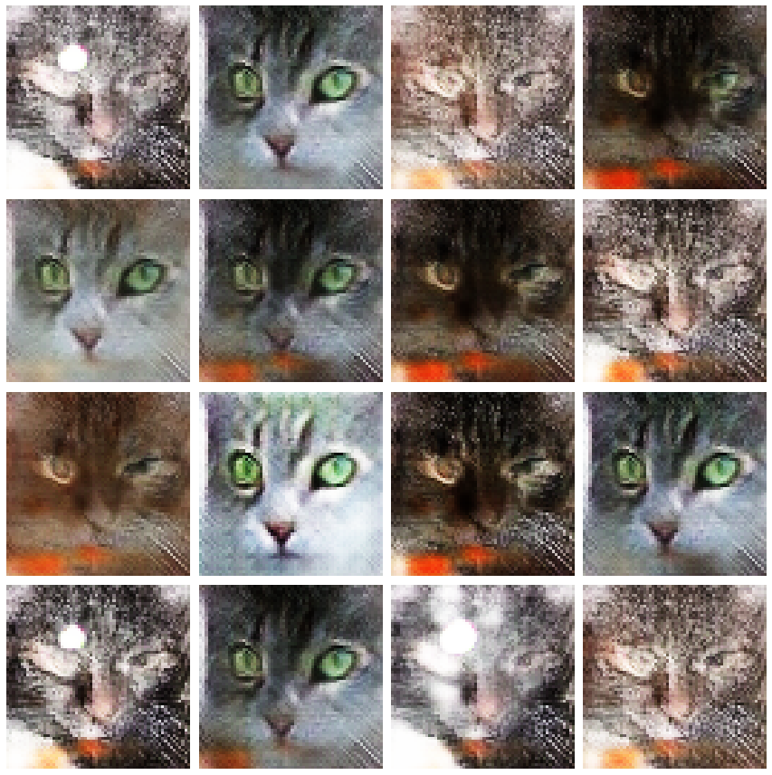

# CatFaceGeneratorGAN

A cat face image generator created using Generative Adversarial Networks (GAN). This project trains a model to generate new cat faces based on a dataset of 64x64 images.

<br>

## Dataset
[Cats faces 64x64 (For generative models)](https://www.kaggle.com/datasets/spandan2/cats-faces-64x64-for-generative-models)

<br>

## Technologies Used:
- Jupyter Lab
- Python
- TensorFlow / Keras
- OpenCV
- NumPy
- Matplotlib
- GAN (DCGAN architecture)
- Kaggle Kernels (with GPU)

<br>

## How to Run:

1. Clone this repository to your local machine:
   ```bash
   git clone https://github.com/jabka1/CatFaceGeneratorGAN.git
   ```
2. Navigate to the project directory:
   ```bash
   cd CatFaceGeneratorGAN
   ```
3. Launch Jupyter Lab:
   ```bash
   jupyter lab
   ```
4. Open the notebook.

<br>

## Demo:

Here are some examples of generated cat face images:



<br>
